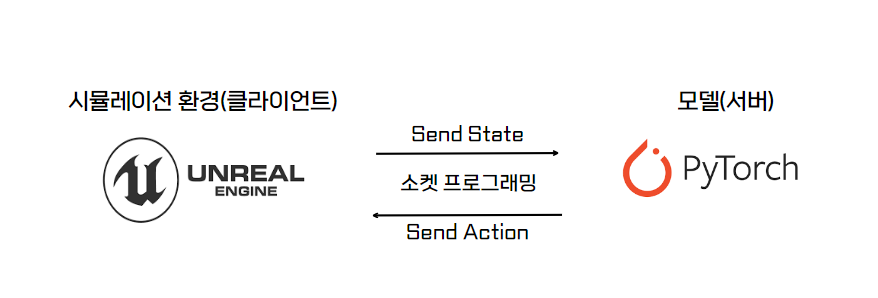

### <h2>❗  ReinforceLearning - SimpleShooter </h2>
>  __한양대학교 컴퓨터소프트웨어학부 졸업프로젝트  
개발 기간 : 2024.03 ~__

<br>

### <h2>🧑 구성원 </h2>
> __한양대학교 컴퓨터소프트웨어학부 4학년 김기환  
 한양대학교 컴퓨터소프트웨어학부 4학년 이준수__

<br>

### <h2>📚 프로젝트 소개 </h2>
<br>
<p align="center">

</p>

<br>

__딥러닝 라이브러리 Pytorch와 언리얼엔진을 이용하여 게임 속에서 발생할 수 있는 동적인 환경을 학습하는 <span style="color:#ffd33d"> 강화학습 에이전트</span>를 구현합니다.__

- 언리얼엔진을 통해 강화학습에 사용될 상태(State)값을 얻어낼 수 있는 시뮬레이션 환경을 구현합니다.
    - 시뮬레이션 환경(클라이언트)에서 얻은 상태값을 TCPSocket 통신을 통해 강화학습 모델(서버)로 전달합니다.

- 시뮬레이션 환경에서 얻어낸 상태값을 바탕으로 현재 상태(State)에서 가장 적절한 행동(Action)을 뽑아낼 수 있도록 강화학습 리워드로직을 구현합니다.
    - 모델에서 계산된 현재 상태에서 가장 적절한 액션 값을 다시 시뮬레이션 환경(클라이언트)로 전달합니다.

- __시뮬레이션 환경에서는 모델로부터 전달받은 현시점 가장 최적의 행동을 취합니다. 이후, 행동을 취한 후의 상태값을 다시 모델로 전달합니다. 모델은 매 시점 전달받은 상태값을 바탕으로 다시 최적의 행동을 클라이언트로 전달합니다.__ 

<br>

### <h2>🏙️ 시뮬레이션 환경 (클라이언트) </h2>
좀비 아포칼립스 세상에서 몰려드는 좀비를 막아 전초기지를 방어하는 컨셉을 바탕으로 게임 시뮬레이션 환경을 구현하였습니다.
- 플레이어는 4개의 무기와 4개의 방어구를 가지고 플레이하게 됩니다.
- 플레이어는 상대(에이전트)의 무기와 동일한 종류의 방어구를 착용 시 상대의 공격으로 부터 절반의 피해를 입습니다.
- 플레이어는 상대(에이전트)의 방어구와 다른 종류의 무기를 착용하여 공격 시 온전한 피해를 입힐 수 있습니다.
- 에이전트는 총 5개의 무기와 4개의 방어구를 가지고 시작됩니다.
- 다수의 상대(에이전트)는 모델로부터 매 시점 최적의 행동을 받아와 취합니다.
    - __이동 관련__
        - 아이템이 가까운 에이전트는 아이템을 획득하러 이동합니다.
        - 상대(플레이어)와 가까운 에이전트는 상대를 공격하려 상대와 가까이 이동합니다. 
    - __장비 변경 관련__
        - 상대(플레이어)의 무기와 동일한 종류의 방어구를 착용하여 적은 피해를 입도록 갈아입습니다.
        - 상대(플레이어)의 방어구와 다른 종류의 무기를 착용하여 온전한 피해를 입힐 수 있도록 갈아입습니다.

<br><br>


### <h2>🧠 모델 (서버) </h2>
State의 차원이 큰 경우 최적의 행동을 뽑아내기 어려운 Q-Learning의 한계를 해결하기 위해 <span style="color:#ffd33d"> Deep Learning과 결합한 DQN 알고리즘 </span>을 바탕으로 시뮬레이션 환경으로부터 전달받은 State의 차원이 큰 경우에도 최적의 행동을 계산해낼 수 있도록 구현하였습니다.  

<br>

상태값(State)를 기반으로 최적의 행동을 계산하는 두 가지 모델을 구현하였습니다.
- 상대(플레이어) 혹은 아이템과 가까워지도록 이동하는 모델. (이동 관련 모델)
- 상대(플레이어)에게 온전한 피해를 입히고, 상대(플레이어)로부터 적은 피해를 받을 수 있도록 하는 장비를 변경하는 모델 (장비 변경 관련 모델)


>### 에이전트 이동 관련 모델
>---
>- State
>    - 에이전트의 현재 방향, 에이전트의 좌표(X, Y)
>    - 상대(플레이어) 혹은 아이템의 좌표(X, Y)
>    - 상대(플레이어) 혹은 아이템과의 거리
>- Action
>    - 에이전트의 회전각도 값(0 ~ 360)을 0 ~ 15의 수로 매핑
>- Reward
>    - 이전 State의 거리와 Action을 취한 후의 State의 거리의 줄어드는 양 만큼 Reward를 제공
<br>
>### 결과 영상 
> - 다수의 에이전트들이 각각 가까운 아이템 혹은 플레이어를 향해 이동
><br>
>   


<br>


<br>

>### 장비 변경 관련 모델
>---
>- State
>   - 상대(플레이어)의 무기 번호, 방어구 번호
>   - 에이전트의 무기 번호, 방어구 번호
>- Action
>   - 에이전트는 총 5개의 무기, 4개의 방어구를 소지하고 있습니다. (0, 0) ~ (5, 4)의 가능한 경우의 수를 0 ~ 19의 수로 매핑
>- Reward
>   - 상대(플레이어)의 방어구와 다른 종류의 무기를 착용 시 (온전한 피해를 입힐 수 있음) -> 양의 리워드
>   - 상대(플레이어)의 무기와 동일한 종류의 방어구 착용 시 (적은 피해를 받을 수 있음) -> 양의 리워드
<br>
>### 결과 영상
>   - 플레이어의 무기에 따라 적절한 방어구로 변경
><br>
> 

<br>

### <h2>📁 디렉토리 구조 </h2>
```
RL_SimpleShooter
├── RL_SimpleShooter_Clinet(Unreal)             # 시뮬레이션 환경 (클라이언트)
├── RL_SimpleShooter_Server_ChangeEquipment     # 장비 변경 관련 모델 (서버1)
│   ├── result                                  # 학습 결과 저장
│   ├── GameMaster.py
│   ├── Communication.py
│   ├── Buffer.py
│   ├── Model.py
│   ├── Play.py
│   ├── Train.py
├── RL_SimpleShooter_Server_Movement            # 이동 관련 모델 (서버2)
│   ├── result                                  # 학습 결과 저장
│   ├── GameMaster.py
│   ├── Communication.py
│   ├── Buffer.py
│   ├── Model.py
│   ├── Play.py
│   ├── Train.py
```

<br>

### <h2>🔧 STACKS</h2>
<div align=center> 

 
<br>


<br>


</div>
<br>

### <h2>🔄 현재 진행 상황 </h2>
- 장비 변경 모델 학습 중
- 이동 관련 모델 수정 진행 중, 더욱 복잡한 시뮬레이션 환경에 대응
    - 장애물을 회피하며 가까운 아이템 혹은 플레이어에게 다가가도록 
    - State의 경우의 수를 줄여 학습의 효율을 향상시킬 수 있는 방안을 모색 중